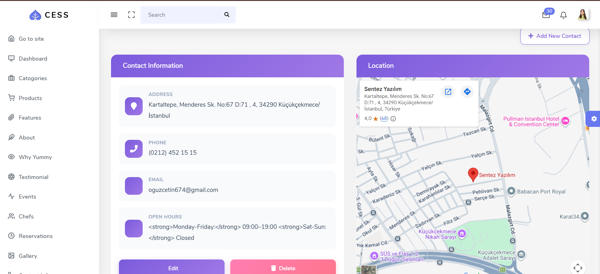
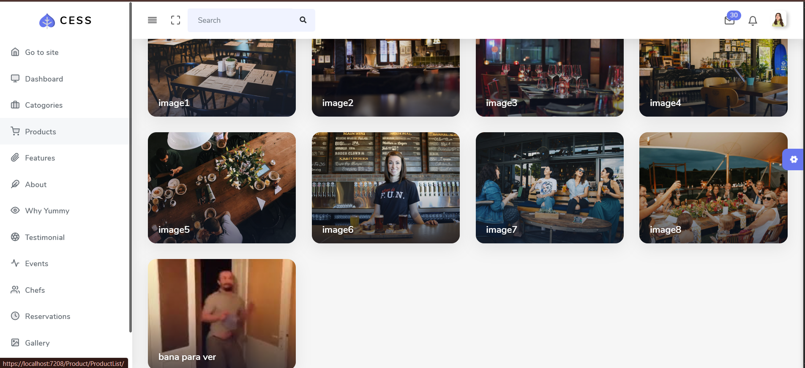
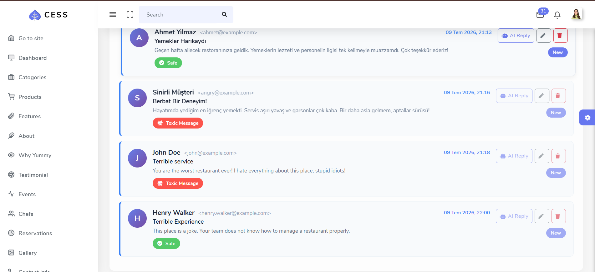
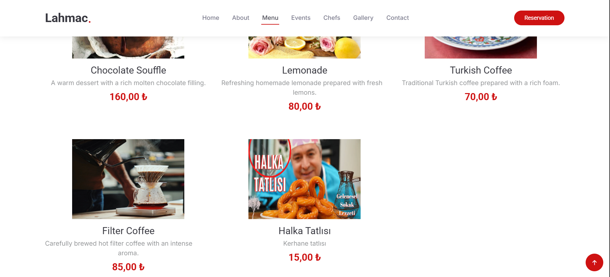

<h1 align="center">🍽️ Yummy Restaurant — API & Admin Dashboard</h1>

<p align="center">
  A fully-featured, modern restaurant management platform built with <b>ASP.NET Core 6</b>. It seamlessly integrates a RESTful Web API, an elegant MVC front-end with a <b>Premium Glassmorphism Admin Panel</b>, and cutting-edge <b>AI capabilities</b> (OpenAI & Hugging Face) for automated content generation and message moderation.
</p>

<p align="center">
  
  
  
  
  
  
</p>

---

## 📑 Table of Contents

- [Overview](#-overview)
- [Key Features](#-key-features)
- [AI & Integrations](#-ai--integrations)
- [Architecture](#-architecture)
- [Tech Stack](#-tech-stack)
- [Getting Started](#-getting-started)
- [Configuration (API Keys & Secrets)](#-configuration-api-keys--secrets)
- [API Reference](#-api-reference)
- [Screenshots](#-screenshots)

---

## 🧭 Overview

**APIProject6** is a comprehensive restaurant management web application composed of two independent projects working in harmony:

| Project | Role |
| ------- | ---- |
| **APIProject6.WebAPI** | RESTful Web API — data access, business rules, and persistence via Entity Framework Core + SQL Server. |
| **APIProject6.WebUI** | ASP.NET Core MVC front-end — Features a public restaurant website and a beautifully crafted, modern **Admin Dashboard** utilizing premium CSS design concepts (Glassmorphism, CSS Grid). |

Beyond standard CRUD operations, the platform acts as an intelligent assistant by introducing **AI-powered features**: Recipe generation, AI-assisted customer support, and automatic **translation + toxicity moderation** for inbox messages.

---

## ✨ Key Features

### Web API
- 🏗️ **RESTful Architecture** with clean, resource-oriented endpoints.
- 🔄 **Full CRUD operations** across all domain modules (Categories, Products, Chefs, Messages, etc.).
- 🗄️ **Entity Framework Core (Code-First)** with SQL Server backend.
- 📦 **DTO-based data transfer** configured seamlessly with **AutoMapper**.
- ✅ **FluentValidation** for robust incoming request validation.
- 📖 **Swagger / OpenAPI** integration for interactive documentation and testing.

### Premium Web UI & Admin Panel
- 🎨 **Modern Design System**: The Admin Dashboard features a highly polished UI with **Glassmorphism** effects, responsive CSS Grids, smooth hover micro-animations, and gradient buttons.
- 🖼️ **Native Image Lightbox**: A beautifully integrated gallery page for administrators with a native, dependency-free CSS/JS lightbox.
- 📍 **Interactive Contact Map**: Embedded Google Maps UI directly into the admin contact panel for real-time location previewing.
- 🌐 **Public Website**: A complete front-end for customers featuring hero banners, dynamic menus, chefs, testimonials, and contact forms.
- 🚀 **ViewComponents**: Reusable, modular UI components to keep Razor views clean.

### AI-Powered Integrations
- 🤖 **AI Recipe Generator (OpenAI)**: Input ingredients and receive a beautifully formatted recipe instantly.
- 💬 **Smart Support Replies (OpenAI)**: The system reads customer feedback and drafts polite, on-brand responses (handling complaints, questions, or praise automatically).
- 🌐 **Auto-Translation (Hugging Face)**: Translates incoming Turkish messages to English seamlessly in the background (`Helsinki-NLP/opus-mt-tr-en`).
- 🛡️ **Toxicity Moderation (Hugging Face)**: Scans incoming messages using a classifier (`unitary/toxic-bert`), flagging them as safe or toxic. 
- ⚡ **Retroactive Moderation**: A dedicated one-click *"Analyze Toxicity"* feature for messages manually inserted into the database.

---

## 🧠 AI & Integrations

| Capability | Provider | Model / Endpoint | Where |
| ---------- | -------- | ---------------- | ----- |
| **Recipe Generation** | OpenAI | Chat Completions API | `AIController.CreateRecipeWithOpenAI` |
| **Support-reply Drafting** | OpenAI | Chat Completions API | `MessageController.AnswerMessageWithOpenAI` |
| **Message Translation** | Hugging Face | `Helsinki-NLP/opus-mt-tr-en` | `MessageController.SendMessage` |
| **Toxicity Classification** | Hugging Face | `unitary/toxic-bert` | `MessageController.SendMessage` & `AnalyzeExistingMessage` |

> **Security Note:** All AI keys are supplied through configuration (`dotnet user-secrets`) and are **never committed to source control**.

---

## 🏗️ Architecture

```text
APIProject6/
├── APIProject6.WebAPI/          # RESTful Web API Layer
│   ├── Controllers/             # API Endpoints
│   ├── Context/                 # EF Core DbContext
│   ├── Dtos/                    # Data Transfer Objects
│   ├── Entities/                # Domain models
│   ├── Mapping/                 # AutoMapper profiles
│   ├── Migrations/              # EF Core Code-First migrations
│   └── ValidationRules/         # FluentValidation rules
│
├── APIProject6.WebUI/           # ASP.NET Core MVC Layer
│   ├── Controllers/             # MVC Controllers (Website, Admin, AI)
│   ├── Views/                   # Razor views with premium styling
│   ├── ViewComponents/          # UI components
│   ├── Dtos/                    # Client-side DTOs
│   └── wwwroot/                 # Static assets (CSS, JS, images)
│
└── APIProject6.sln
```

---

## 🧰 Tech Stack

- **Backend**: ASP.NET Core 6 (Web API & MVC)
- **Database**: Entity Framework Core, Microsoft SQL Server
- **Libraries**: AutoMapper, FluentValidation, Newtonsoft.Json, Swashbuckle
- **AI Services**: OpenAI API, Hugging Face Inference API
- **Frontend**: HTML5, Vanilla CSS3 (Glassmorphism, CSS Grid), JavaScript (ES6), Bootstrap

---

## 🚀 Getting Started

### Prerequisites

- [.NET 6 SDK](https://dotnet.microsoft.com/download/dotnet/6.0)
- Visual Studio 2022 / JetBrains Rider / VS Code
- SQL Server (LocalDB or Express)
- EF Core CLI (`dotnet tool install --global dotnet-ef`)

### 1. Clone & Restore

```bash
git clone https://github.com/Houzcetin/APIProject6.git
cd APIProject6
dotnet restore
```

### 2. Configure the Database
Update the connection string in `APIProject6.WebAPI/Context/APIContext.cs` to point to your local SQL Server instance.

### 3. Apply Migrations
```bash
dotnet ef database update --project APIProject6.WebAPI
```

---

## 🔐 Configuration (API Keys & Secrets)

To enable the AI features (OpenAI and Hugging Face), you must configure your API keys securely using .NET User Secrets:

```bash
cd APIProject6.WebUI

dotnet user-secrets init
dotnet user-secrets set "OpenAI:ApiKey" "sk-your-openai-key"
dotnet user-secrets set "HuggingFace:ApiKey" "hf_your-huggingface-token"
```

---

## ▶️ Running the Applications

Both projects must be running simultaneously. The **Web UI** expects the **Web API** to be hosted at `https://localhost:7277`.

1. **Start the Web API:**
   ```bash
   dotnet run --project APIProject6.WebAPI
   ```
   *Swagger documentation will be available at `https://localhost:7277/swagger`.*

2. **Start the Web UI:**
   ```bash
   dotnet run --project APIProject6.WebUI
   ```
   *The main application will be available at `https://localhost:7208`.*

---

## 📡 API Reference

The API follows strict RESTful conventions. Here is an example of the `/api/Products` endpoint:

| Method | Endpoint | Description |
| ------ | -------- | ----------- |
| `GET`  | `/api/Products` | List all products |
| `POST` | `/api/Products` | Create a new product |
| `GET`  | `/api/Products/GetProduct?id={id}` | Get a product by ID |
| `PUT`  | `/api/Products` | Update an existing product |
| `DELETE` | `/api/Products?id={id}` | Delete a product |

---

## 📸 Screenshots

### 1. Modern Admin Dashboard (Glassmorphism & Grid UI)
<p align="center">
  
</p>

### 2. Premium Image Gallery & Native Lightbox
<p align="center">
  
</p>

### 3. AI Message Moderation (Toxic-Bert) & Auto-Reply
<p align="center">
  
</p>

### 4. Public Restaurant Website
<p align="center">
  
</p>

---

<p align="center">
  <b>Developed by Oğuz Çetin</b><br>
  <a href="https://github.com/Houzcetin">GitHub Profile</a>
</p>
<p align="center"><i>Built with passion, ASP.NET Core 6, and modern AI.</i></p>
